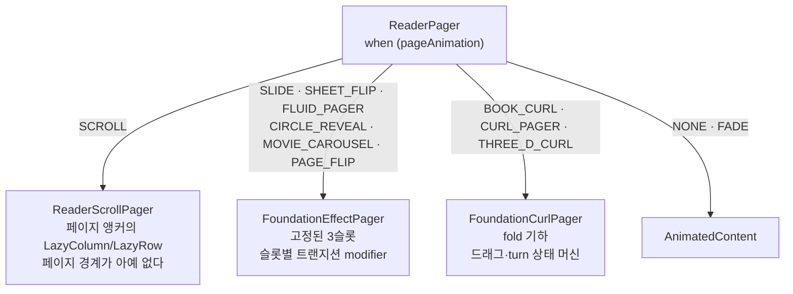
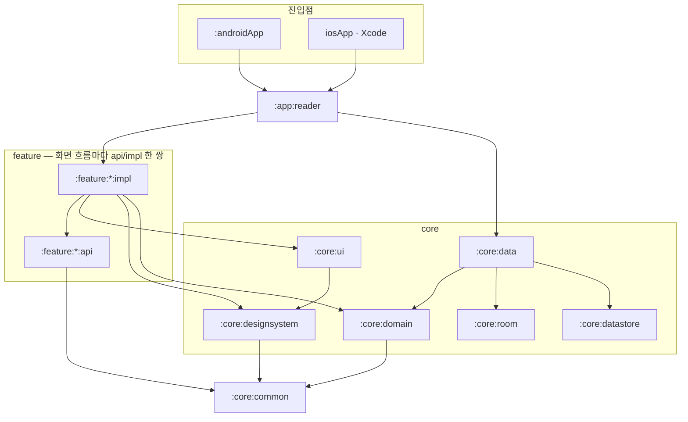

# TeddReader


*[English](README.md)*

기기에 이미 가지고 있는 문서를 읽는 리더입니다. TXT, EPUB, PDF, CBZ, 또는 이미지가 담긴 폴더를
열면 어디까지 읽었는지 기억합니다. Android 와 iOS 가 같은 Kotlin 코드와 같은 Compose UI 를
공유하며, 어디에도 업로드하지 않고 계정을 만들 필요도 없습니다.

## 무엇을 하나

**서재.** 기기 저장소에서 파일을 가져오거나 Google Drive 에서 고릅니다. 최근순·제목순·형식순으로
정렬하고, 형식으로 거르고, 직접 이름 붙인 폴더로 묶습니다. 홈 화면은 마지막에 읽던 문서를 가장
앞에 보여줍니다.

**읽기.** 페이지는 가로나 세로로 넘기거나 이어서 스크롤합니다. 태블릿이나 펼친 폴더블에서는 두
페이지를 나란히 펼치고 접히는 부분에 여백을 두어, 글자가 접힘선에 빠지지 않습니다 —
[두 페이지 펼침](#두-페이지-펼침) 참고.

**페이지 넘김.** 열 가지이고, 그중 셋은 손가락을 따라 움직이다가 놓는 지점에서 자리를 잡습니다 —
[페이지 넘김](#페이지-넘김) 참고.

**글자.** 크기, 줄 높이, 글꼴 계열(문서 자체 글꼴·고딕·세리프·고정폭), 그리고 굵기 300~600.
강조는 고른 굵기를 기준으로 정해지므로, 어느 굵기에서든 제목이나 굵은 문장이 본문과 같은 대비를
유지합니다. 본문은 실제로 측정한 줄 상자를 기준으로 다시 나누므로, 크기를 키우거나 굵기를 올려도
잘리지 않고 다시 흐릅니다.

**편안하게.** 페이지 색은 문서를 따르거나, 시스템을 따르거나, 라이트·다크·세피아 중에서 고릅니다.
디스플레이 자체의 최저 밝기보다 어둡게 읽을 수 있는 조광 오버레이가 있고, 자동 스크롤은 픽셀·줄·
페이지 단위로 넘어갑니다. 앱 언어는 시스템을 따르거나 한국어 또는 영어로 고정할 수 있습니다.

**읽던 자리 찾기.** 책갈피, 문서 내 검색, 페이지 이동, 진행률 슬라이더, 문서 정보 시트를 제공합니다.
읽던 위치는 문서마다 텍스트 기준점으로 저장되므로, 글꼴을 바꿔 페이지 번호가 전부 달라져도
그대로 유지됩니다.

## 형식

| 형식 | 한 페이지가 무엇인가 | 파서 |
| --- | --- | --- |
| TXT | 측정된 텍스트. 활자 설정이 바뀌면 다시 흐른다 | `TxtDocumentParser`, `TxtTextDecoder` |
| EPUB | 인라인 구조를 가진 측정된 텍스트. spine 아이템 하나씩 | `EpubDocumentParser`, `EpubXhtmlParser`, `EpubCssEngine`, `EpubNavigationParser` |
| PDF | 플랫폼 PDF 엔진이 렌더링한 페이지 하나 | `PdfDocumentParser`, `PdfMetadataReader` |
| CBZ | 정렬된 압축 항목 하나 | `ComicBookDocumentParser` |
| 이미지 | 고른 폴더 안의 파일 하나 | `ImageDocumentParser`, `ImageDimensionSniffer` |

`DocumentFormatDetector` 는 세 가지를 함께 봅니다. 어느 하나도 단독으로는 믿을 수 없기
때문입니다: 표시 이름, 소스가 보고한 MIME 타입, 그리고 PDF 와 래스터 이미지에 한해 파일 앞부분
바이트입니다. 클라우드 제공자는 `application/octet-stream` 을 보고할 수 있고, 콘텐츠 URI 로 연
문서는 확장자가 아예 없을 수도 있습니다. CBZ 는 의도적으로 MIME 타입이나 리터럴 `.cbz` 확장자로만
인식하고 시그니처로는 판별하지 않습니다 — 모든 CBZ 는 `.docx` 나 일반 `.zip` 과 같은 ZIP
시그니처를 공유하므로, 스니핑하면 그것들이 만화로 잘못 분류됩니다.

## 문서가 페이지가 되기까지


임포터 뒤의 모든 화살표는 평평한 문자열과 범위 위의 순수 Kotlin 입니다. 그래서 같은 파이프라인이
Android 와 iOS 시뮬레이터에서 테스트 아래 똑같이 돕니다.

1. **가져오기.** `DocumentImporter` 가 파일을 앱 저장소로 복사합니다 — Android 는 SAF 와 Drive
   인텐트 센더, iOS 는 `UIDocumentPickerViewController` 와 `GoogleDrivePicker.swift` 브리지입니다.
   그 이후로 파일 시스템에 손을 대는 것은 `DocumentFileSource` 뿐입니다.
2. **섹션으로 파싱.** 형식별 파서가 바이트를 `ReaderSection` 으로 바꿉니다: 평면 텍스트와, 그
   텍스트 위의 문자 범위로 표현된 `ReaderBlock` 구조(문단·제목·인용·목록 항목·표 셀·이미지 등)
   입니다. 구조가 텍스트를 소유하지 않으므로 검색·책갈피·읽던 위치가 모두 같은 평면 문자열을
   기준으로 삼습니다.
3. **페이지로 나누기.** 페이지 경계가 정해지는 유일한 곳이 `TextPageLayoutEngine` 이고, 여기에는
   불변식이 하나 있습니다: **페이지는 절대 두 섹션에 걸치지 않는다.** EPUB spine 아이템 하나는 그
   자체로 독립된 문서이므로, 챕터 제목이 이전 챕터 마지막 페이지 중간이 아니라 새 페이지 맨 위에
   옵니다 — 그리고 어떤 섹션이든 이웃을 건드리지 않고 측정·저장·복원·추가할 수 있습니다.
4. **실제로 측정.** 페이지 나누기는 추정한 글자 수가 아니라 Compose 텍스트 레이아웃이 측정한 줄
   상자를 기준으로 `ReaderPageMeasureDispatcher` 위에서 돕니다. 크기나 굵기를 바꾸면 책이 다시
   흐릅니다.
5. **자리 기억.** 위치는 페이지 번호가 아니라 텍스트 기준점(섹션 안의 문자 오프셋)으로 저장되므로,
   페이지가 다시 나뉘어도 그대로 남습니다.

## 페이지 넘김

열 가지가 있습니다. `ReaderPager` 가 `PageAnimation` 으로 네 갈래 중 하나에 넘기며, 두 Foundation
페이저는 같은 3슬롯 window 와 같은 단계 규율을 공유합니다.



두 Foundation 페이저 모두 turn 사이에는 페이저를 가운데 슬롯에 고정해 두고 페이저 자신의 배치를
상쇄해, 세 슬롯이 같은 자리에 겹치게 합니다. 그래야 fold 를 gutter 를 가로지르는 노드 하나로 그릴 수
있고, reveal 모양이 빈 슬롯이 아니라 그 아래 페이지에 대고 클리핑됩니다.

| 효과 | 무엇이 구동하나 |
| --- | --- |
| 없음, 슬라이드, 페이드 | 페이저 오프셋 |
| 스크롤 | 이어지는 리스트. 페이지 경계 자체가 없다 |
| 플루이드 페이지, 원형 전환 | 페이저 오프셋. 드러나는 모양의 시작점은 터치 지점 |
| 무비 캐러셀 | 페이저 오프셋. 떠나는 페이지에 깊이감 디밍 |
| 컬 페이지, 3D 컬, 페이지 플립 | 손가락. 놓는 지점에서 자리를 잡는다 |

두 페이지 펼침에서 손가락으로 구동되는 셋은 전체를 밀어내지 않고 **책등에서 한 장만** 접으며, 그
한 장은 gutter 를 건널 수 있는 노드 하나에 그립니다 — 한 장을 두 pane 노드에 쪼개 그리면 사이
gutter 가 빈 채로 남아 화면 가운데 이음선처럼 보입니다.

### 3D 컬

시트가 물결치는 게 아니라 실린더에 감깁니다. leaf 를 따라 세 구간입니다: 책등에서 crease 까지는
평면, 그다음은 반지름 `r` 의 실린더에 호 길이 `PI * r` 만큼 감김, 그 뒤로는 다시 평면이 되어 책등
밖으로 뻗습니다. crease 는 시트의 끝이 선형으로 이동해 진행률 정확히 절반에서 책등을 지나도록
배치합니다 — 넘어가는 페이지가 spine 쪽으로 줄어들다 사라지는 대신 반대쪽 페이지를 덮는 것이 이
때문입니다. `r` 은 turn 의 양 끝에서 0 으로 수렴하므로 양쪽 정지 상태가 항등 매핑이고 leaf 가
평평하게 안착합니다.

표면 법선은 감김 각도만큼 돌아가므로 `PI / 2` 를 넘은 컬럼은 카메라에서 돌아서 leaf 의 뒷면으로
그려집니다 — 그 구간은 목적지가 소스와 반대로 흐르고, 그래서 turn 도중 뒷면이 좌우 반전되어 보이며
텍스처도 반대쪽 끝에서 읽어야 합니다. cast shadow 는 시트의 선행 엣지 바로 바깥에 깔리는데, 앞면은
감기는 쪽이고 뒷면은 시트의 끝입니다. 둘을 같은 엣지에 묶으면 넘기는 방향에 따라 그림자가 다르게
보입니다.

이 전부가 `Float` 위의 순수 함수입니다 — crease 이동, strip 기하, 조명, 펼침 pane 너비, 미러
패리티. 그래서 기기 없이 기하를 검증하고, 그리기 코드는 그 함수들이 낸 값만 소비합니다.

## 두 페이지 펼침

| 규칙 | 값 |
| --- | --- |
| 두 pane 이 되는 조건 | 짧은 변이 `600.dp` 이상이거나, 접힘이 책등일 때 |
| gutter | 책등이면 `max(16.dp, 힌지 두께)`, 그 외에는 `16.dp` |
| 왼쪽 pane 몫 | 접힘 위치에서 도출하고 `0.2 .. 0.8` 로 clamp |

접힘이 책등으로 인정되는 것은 수직이면서 창을 실제로 분리할 때뿐입니다 — 평평하거나 수평인 힌지를
보고하는 폴더블은 해당하지 않습니다. pane 개수와 gutter 둘 다 이 조건으로 게이트하므로 평평하게
펼쳐 둔 기기가 원치 않는 펼침을 받는 일이 없고, 몫 clamp 는 중심에서 벗어난 힌지가 한쪽 pane 을
0 으로 짓누르지 못하게 막습니다.

`rememberDisplayFold()` 가 창의 레이아웃 정보를 구독해 첫 접힘 feature 를 dp 로 보고하고, 그
아래는 전부 너비·높이·그 접힘의 순수 함수입니다.

## 아키텍처

### 모듈 그래프



위 그래프 안의 모든 모듈은 `core:common` 에도 의존합니다. 가독성을 위해 그중 세 개만 그렸습니다.
(`androidApp` 과 `baselineprofile` 은 아닙니다 — 각각 `app:reader` 와 테스트 도구에만 의존합니다.)
`app:reader` 는 여기에 더해 모든 `core` 와 모든 `feature:api` 를 봅니다 — 정확한 배선은 아래 표를
보세요.

이 설계를 지탱하는 성질은 두 가지입니다. **어떤 `feature` 도 `core:data` 를 보지 않습니다** — 화면은
필요한 것을 `core:domain` 인터페이스로 선언하고, 구현은 그래프가 건네줍니다. 그리고 **`core:common`
은 다른 모듈에 의존하지 않고**, 플랫폼·UI 성격의 것에도 의존하지 않습니다 — kotlinx 직렬화·datetime·
불변 컬렉션·코루틴과 로거뿐입니다. 그래서 그 안의 모델, 페이지 경계 규칙, 페이지 넘김 수식이 전부
기기 없이 JVM 과 iOS 시뮬레이터에서 단위 테스트됩니다.

### 레이어 규칙

각 행은 컨벤션 플러그인이 실제로 연결하는 것입니다. 모듈 자신의 빌드 파일은 보통 `id(...)` 한 줄이고
의존 블록 자체가 없습니다.

| 모듈 | 의존 가능 대상(모듈) | 연결하는 플러그인 |
| --- | --- | --- |
| `core:common` | 없음 | `teddreader.core.common` |
| `core:domain` | `core:common` (`api`) | `teddreader.core.domain` |
| `core:data` | `core:common`, `core:domain` (둘 다 `api`), `core:room`, `core:datastore` | `teddreader.core.data` |
| `core:room`, `core:datastore` | `core:common` | `teddreader.core.room`, `teddreader.core.datastore` |
| `core:designsystem` | `core:common` | `teddreader.core.designsystem` |
| `core:ui` | `core:common`, `core:designsystem` | `teddreader.core.ui` |
| `feature:<name>:api` | `core:common` | `teddreader.feature.api` |
| `feature:<name>:impl` | 자기 `api`, `core:common`, `core:domain`, `core:designsystem`, `core:ui` | `teddreader.feature.impl` |
| `app:reader` | 모든 `core` 와 모든 `feature` | `teddreader.app.reader` |
| `androidApp` | `app:reader` 만 | `teddreader.android.app` |

`core:data` 는 `core:common` 과 `core:domain` 을 `api` 로 다시 내보냅니다 — 그 둘의 *구현*이기
때문입니다. 나머지는 모두 `implementation` 이라, 어떤 모듈도 이름 대지 않은 전이 의존에 닿을 수
없습니다.

### api / impl 분리

`home`, `reader`, `search`, `bookmarks`, `document-info`, `settings` 가 모두 같은 모양입니다. `api`
쪽은 라우트 타입과 호출자가 정당하게 필요로 하는 것만, `impl` 쪽은 화면·뷰모델·컴포넌트를 담습니다.
`teddreader.feature.impl` 이 위 다섯 개만 정확히 연결하므로 **한 기능은 다른 기능의 내부에 닿을 수
없습니다** — 관례가 아니라 클래스패스에 없기 때문입니다. 기능 간 의존을 추가하려면 컨벤션 플러그인을
고쳐야 하고, 그건 import 가 아니라 눈에 보이는 설계 결정이 됩니다.

### 리뷰가 아니라 빌드가 강제하는 것

| 불변식 | 깨질 때 |
| --- | --- |
| 어떤 기능도 `core:data` 나 다른 기능의 `impl` 에 닿지 않는다 | 클래스가 클래스패스에 없다 |
| `androidx.compose.material3` 는 Material 을 감싸는 모듈에서만 import 된다 | `teddreader.kmp.compose` 를 적용한 모든 모듈에서 `check` 에 연결된 `checkMaterial3Imports` 실패 |
| Compose 안정성이 조용히 퇴행하지 않는다 | `-Pteddreader.composeReports` 로 모듈별 컴파일러 리포트 생성 |

Material 3 게이트가 있는 이유: 앱이 쓰는 모든 Material 컴포넌트를 감싸서 색·모양·서체·ripple 이
Material 기본값이 아니라 앱 토큰에서 오게 하는데, 이 속성은 다른 코드가 Material 을 직접 import
할 수 없을 때만 유지됩니다. `core:ui` 와 `core:designsystem` 은 전면 허용이고, 리더의 목차 drawer
는 심볼 5개짜리 명시적 예외입니다 — swipe·back·focus trap 을 플랫폼에 위임하고 사용처가 하나뿐이라
wrapper 로 얻을 게 없습니다.

### 의존성 주입

Koin 을 쓰고, 배선은 `koin-annotations` 와 `io.insert-koin.compiler.plugin` 컴파일러 플러그인이
합니다 — KSP 가 아닙니다. 이 레포에서 KSP 를 쓰는 것은 Room 뿐입니다. `teddreader.koin` 이 정의를
소유하는 모든 모듈에 플러그인과 `koin-annotations` 를 얹기 때문에, 정의는 그것이 만드는 코드 바로
옆에 있습니다: `core:data` 의 저장소 구현·파서·레이아웃 엔진에는 `@Single`, 여섯 기능의 뷰모델에는
`@KoinViewModel` 이 붙고, 각 레이어와 기능은 자기 패키지를 `@ComponentScan` 경계로 지정하는
`@Module` 하나를 가집니다.

진입점은 `app:reader` 의 `ReaderAppModule` 하나이고, 그 내용은 `@Module(includes = [...])` 목록이
전부입니다: `DataModule`, `DomainModule`, `DataStoreModule`, `RoomModule`, `PlatformReaderModule`,
그리고 화면 흐름당 하나씩인 `*FeatureModule`. 스캔하지 않는 것은 `RoomModule` 하나뿐입니다 —
주입받은 `TeddReaderDatabase` 에서 DAO 여섯 개를 꺼내 `@Single` 프로바이더로 노출합니다. DAO 는
생성하는 것이 아니라 데이터베이스에서 꺼내는 것이기 때문입니다.

모듈 집합은 `koinConfiguration { module<ReaderAppModule>() }` 로 정적으로 고정되어 있고, 그게
핵심입니다: 런타임에 만든 모듈 목록으로 그래프를 조립하면 컴파일러 플러그인의 전체 그래프 검증이
꺼지지만(`KOIN-W003`), 타입 하나로 고정하면 앱의 모든 바인딩이 컴파일 타임에 검증됩니다.

`PlatformReaderModule` 은 타깃별 `actual` 을 가지는 `@Module expect class` 로, `commonMain` 이
만들 수 없는 것들 — 플랫폼 `DocumentFileSource`, Room 데이터베이스, 리더 환경설정 DataStore — 을
담습니다. Android 쪽 절반은 `Context` 가 필요하고, 그것은 컴포지션에서만 얻을 수 있어 어노테이션
프로바이더의 생성자 파라미터가 될 수 없습니다. 그래서 `ProvidePlatformKoinInput()` 이
`KoinApplication` 보다 먼저 실행되어 플랫폼별 홀더에 값을 채우고, Android `actual` 의
`applicationContext()` 프로바이더가 그 홀더를 읽습니다. `TeddReaderApp` 을 거치지 않고 그래프를
resolve 하면 예외를 던집니다.

`startKoin()` 은 없습니다. `TeddReaderApp` 이 컴포저블 스코프 `KoinApplication` 을 열어, 그래프의
수명이 프로세스가 아니라 그 컴포저블의 수명에 묶이고, 데이터베이스와 DataStore 를 포함한 모든
`@Single` 이 컴포지션당 정확히 한 번만 생성됩니다. 뷰모델은 싱글턴이 아니라 `@KoinViewModel`
입니다 — 화면의 상태는 프로세스 전역으로 살아남는 대신 자기 내비게이션 항목과 함께 죽어야 하기
때문입니다. 그리고 `core:data` 를 볼 수 있는 모듈이 `app:reader` 하나뿐이라, 인터페이스와 구현의
연결은 정확히 한 곳에서만 닿습니다.

### Compose 단계 규율

리더는 손가락 아래에서 텍스트 한 페이지를 통째로 애니메이션합니다. 그래서 리더 UI 전체에 걸친 규칙은
**프레임마다 바뀌는 값은 composition 에서 읽지 않는다** 입니다.

| 값의 종류 | 읽는 단계 | 방법 |
| --- | --- | --- |
| pager 스크롤 오프셋, turn 진행률, 접힌 edge, 핀치 확대·이동 | layout·draw | `() -> T` 로 넘겨 `graphicsLayer { }` 나 `drawWithCache { }` 안에서 호출. 두 블록은 자기 snapshot 관찰자와 함께 돌기 때문에 재구성 없이 다시 실행된다 |
| side, 방향, 임계값 통과 여부 | composition | `derivedStateOf` 로 파생 — 이산 답이 실제로 뒤집힐 때만 슬롯이 재구성된다 |

이 코드를 고치기 전에 알아야 할 세 가지:

- **`drawWithCache` 블록에서는 모든 provider 를 어떤 early return 보다 먼저 호출**해야 합니다.
  Compose 는 실제로 실행된 read 만 등록하므로, `return@drawWithCache` 뒤에 호출된 provider 는
  구독을 잃고 효과가 turn 중간에 멈춥니다.
- **`Modifier.zIndex` 는 composition 시점 `Float` 을 요구**하므로, 쌓임 순서는 오프셋의 연속 함수가
  아니라 "이 이웃이 다가오는 중인가" 같은 이산 등급으로 표현합니다.
- **그 프레임에 안 보이는 leaf 는 alpha 0 으로 그리는 대신 배치하지 않습니다.** 그래야 그리기와
  히트 테스트에서 함께 빠지고, 아래 페이지로 갈 탭을 조용히 삼키지 않습니다.

수동 제스처 상태도 같은 방식으로 갈립니다. 원시 포인터 좌표는 snapshot 으로 두되 그리기 블록과 포인터
루프에서만 읽고 composition 에서는 결코 읽지 않으며, composition 이 관찰하는 것은 값이 실제로 달라질
때만 기록되는 작은 `(active, side)` phase 하나뿐입니다. 그래서 드래그가 시작된 프레임부터 방향이 확정되는 프레임까지 재구성 비용이 0 입니다.

### 플랫폼 경계

공유 코드는 `commonMain` 에 있고, 플랫폼이 실제로 다른 지점에서만 `androidMain` / `iosMain` 으로
내려갑니다.

| `expect` 선언 | Android | iOS |
| --- | --- | --- |
| `rememberDisplayFold()` | `WindowInfoTracker` 의 접힘 feature 를 dp 로 변환 | `null` — 폴더블 iOS 기기가 아직 없다 |
| `PlatformPdfPageSurface` | `android.graphics.pdf.PdfRenderer` | `UIKitView` 안의 PDFKit |
| `decodeLegacyKoreanText` | JVM charset 디코딩 | `kCFStringEncodingDOSKorean` |
| `ReaderPageMeasureDispatcher` | `Dispatchers.Default` | `Dispatchers.Main` — 텍스트 측정이 메인 스레드 전용 |
| `foundationPagerRenderProfile` | 컬 mesh 25 컬럼, 그림자 1 겹 | 12 컬럼, 4 겹 |
| `drawFoundationPagerCurlShadow` | `Paint.setShadowLayer` 네이티브 블러 한 번 | 반투명 path 를 겹쳐 부드러운 가장자리 |
| `rememberDocumentImporter` | SAF 와 Drive 인텐트 센더 | `UIDocumentPickerViewController` 와 Swift Drive 브리지 |

## 저장소 구조

```
TeddReader
├── androidApp/                 Android 진입점과 매니페스트 — app:reader 에만 의존
├── iosApp/                     Xcode 프로젝트, SwiftUI 진입점, Google Drive 피커 브리지
├── app/
│   └── reader/                 앱 조립: Koin 그래프, 내비게이션 호스트, 테마, 임포터
├── core/
│   ├── common/                 모델과 순수 로직 — 플랫폼·프레임워크 의존 없음
│   ├── domain/                 저장소 인터페이스와 유스케이스
│   ├── data/                   저장소 구현, 형식 파서, 페이지네이션 엔진
│   ├── room/                   Room 데이터베이스, 마이그레이션, DAO, 엔티티
│   ├── datastore/              Okio 위의 DataStore 환경설정
│   ├── designsystem/           테마, 색, 타이포그래피, 간격, 아이콘
│   └── ui/                     두 개 이상의 기능이 함께 쓰는 컴포저블
├── feature/                    화면 흐름마다 api / impl 한 쌍
│   ├── home/                   서재: 가져오기, 정렬, 필터, 폴더
│   ├── reader/                 읽기 화면, pager, 페이지 넘김 효과
│   ├── search/                 문서 내 검색
│   ├── bookmarks/              북마크 목록
│   ├── document-info/          메타데이터 시트
│   └── settings/               리더·앱 환경설정
├── build-logic/                컨벤션 플러그인(teddreader.*)과 Material 3 게이트
├── baselineprofile/            Android 베이스라인 프로파일을 만드는 매크로벤치마크
├── compose-stability.conf      Compose 컴파일러에 안정 타입으로 선언하는 목록
└── gradle/libs.versions.toml   버전과 플러그인 좌표의 단일 출처
```

include 목록의 정본은 `settings.gradle.kts` 입니다 — 위 트리는 읽기 보조일 뿐 그것을 대체하지
않습니다.

## 테스트

공통 로직은 `commonTest` 에서 `kotlin.test` 로 검증하며 JVM 과 iOS 시뮬레이터 양쪽에서 실행됩니다.
Android 전용 부분은 `androidHostTest` 에 있습니다. 테스트 케이스는 약 800 개이고, 숫자가 틀려도
화면을 보기 전까지는 드러나지 않는 부분에 무게가 실려 있습니다.

| 모듈 | 케이스 | 무엇을 덮나 |
| --- | --- | --- |
| `core/data` | 316 | 형식 파서, EPUB CSS·내비게이션, 페이지네이션과 섹션 분배 |
| `feature/reader/impl` | 233 | 페이지 목표 계산, 펼침 기하, 페이지 넘김 효과 계산, 뷰모델 상태 |
| `core/common` | 109 | 모델, 블록 구조, 읽던 위치, 검증 |
| `core/ui` | 51 | 여러 기능이 함께 쓰는 리더 컴포저블 로직 |
| `core/domain` | 24 | fake 저장소를 상대로 한 유스케이스 |
| `app/reader`, `feature/home/impl` | 41 | 내비게이션과 서재 목록 동작 |
| 그 외 | 27 | datastore, Room 마이그레이션·엔티티, 디자인 토큰, 검색, 설정, 문서 정보 |

페이지네이션·페이지 목표 계산·펼침 기하·페이지 넘김 효과 계산은 의도적으로 전부 순수 함수로 두어
기기 없이도 테스트할 수 있게 했습니다.

## 빌드

Gradle 실행에는 JDK 17 이상이 필요하고(모듈 자체는 Java 11 타깃), Android SDK 37 과 iOS 쪽을 위한
Xcode 가 필요합니다. SDK 경로는 `local.properties` 에 넣습니다 — 커밋되지 않습니다.

```bash
./gradlew :androidApp:assembleDebug                  # Android 디버그 APK
./gradlew :feature:reader:impl:testAndroidHostTest   # 한 모듈의 JVM 단위 테스트
./gradlew :core:data:iosSimulatorArm64Test           # 같은 테스트를 iOS 시뮬레이터 타깃에서
./gradlew :androidApp:generateBaselineProfile        # 기기에서 베이스라인 프로파일 재생성
```

iOS 는 `iosApp/iosApp.xcworkspace` 를 Xcode 로 열어 `iosApp` 스킴을 실행하거나:

```bash
cd iosApp
xcodebuild -scheme iosApp -destination 'platform=iOS Simulator,name=iPhone 17 Pro' build
```

Google Drive 가져오기는 플랫폼마다 클라이언트 ID 가 필요합니다. iOS 쪽은 gitignore 된
`iosApp/Configuration/Config.xcconfig` 에 넣습니다 —
`iosApp/Configuration/Config.xcconfig.template` 을 그 경로로 복사한 뒤 값을 채우면 됩니다.

## 기술 스택

| 영역 | 쓰는 것 |
| --- | --- |
| 언어, UI | Kotlin 2.4.0, Compose Multiplatform 1.11.1, Material 3 |
| 내비게이션, DI | Navigation 3, Koin 4.2 (Koin 컴파일러 플러그인. KSP 는 Room 만 사용) |
| 저장 | Room 3 및 번들 SQLite, Okio 기반 DataStore |
| 비동기, 데이터 | kotlinx coroutines, serialization, datetime, immutable collections |
| 이미지, 로깅 | Coil 3, Kermit |
| 플랫폼 | 접힘 feature 용 androidx.window. Android minSdk 24, compileSdk 37, AGP 9.2 |
