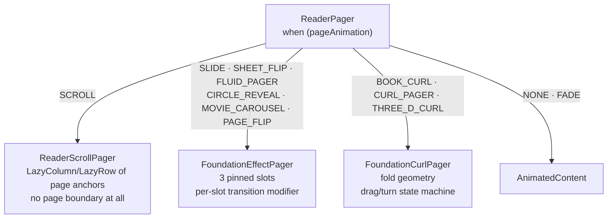
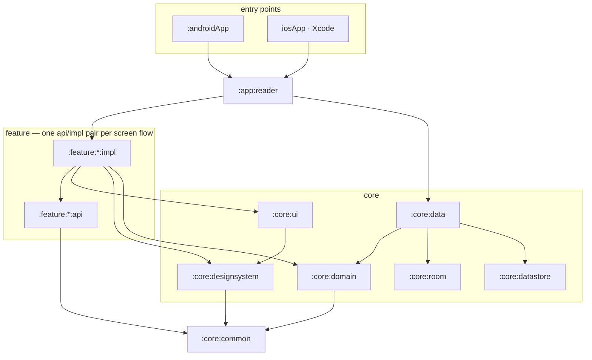

# TeddReader


*[한국어](README.ko.md)*

A reader for the documents you already have on your device. Open a TXT, EPUB, PDF, CBZ or a folder
of images, and it remembers where you stopped. Android and iOS share the same Kotlin and the same
Compose UI; nothing is uploaded anywhere, and there is no account to create.

## What it does

**Library.** Import files from local storage or pick them from Google Drive. Sort by recent, title
or format, filter by type, and group documents into folders you name yourself. The home screen leads
with whatever you were last reading.

**Reading.** Pages turn horizontally or vertically, or scroll continuously. On a tablet or an
unfolded foldable the reader lays out a two-page spread and puts the gutter on the hinge, so the
text never falls into the fold — see [Two-page spread](#two-page-spread).

**Page turns.** Ten of them, three of which follow your finger and settle where you release — see
[Page turns](#page-turns).

**Type.** Font size, line height, family — the document's own, sans, serif or mono — and weight,
from 300 to 600. Emphasis is set relative to the weight you choose, so a heading or a bold run keeps
its contrast against the body at every setting. Text is repaginated against real measured line
boxes, so a larger size or a heavier weight reflows the book instead of clipping it.

**Comfort.** Page colours follow the document, the system, or a light, dark or sepia theme of their
own. A dimming overlay reads below the display's own minimum brightness, and auto-scroll advances by
pixel, line or page. The interface follows the system language, or can be pinned to English or
Korean.

**Finding your place.** Bookmarks, in-document search, a page jump, a progress slider, and a
document info sheet. Reading position is stored per document as a text anchor, so it survives a
font change that renumbers every page.

## Formats

| Format | What one page is | Parsed by |
| --- | --- | --- |
| TXT | measured text, reflowed on every type change | `TxtDocumentParser`, `TxtTextDecoder` |
| EPUB | measured text with inline structure, one spine item at a time | `EpubDocumentParser`, `EpubXhtmlParser`, `EpubCssEngine`, `EpubNavigationParser` |
| PDF | a page rendered by the platform PDF engine | `PdfDocumentParser`, `PdfMetadataReader` |
| CBZ | one entry of the archive, in sorted order | `ComicBookDocumentParser` |
| Images | one file of the folder you picked | `ImageDocumentParser`, `ImageDimensionSniffer` |

`DocumentFormatDetector` weighs three things, because none of them is reliable alone: the display
name, the MIME type the source reports, and — for PDF and raster images only — the file's leading
bytes. A cloud provider may report `application/octet-stream`, and a document opened from a content
URI may carry no extension at all. CBZ is deliberately matched by MIME type or a literal `.cbz`
extension and never by signature: every CBZ shares the ZIP signature with `.docx` and plain `.zip`,
so sniffing would misfile them.

## How a document becomes pages

```mermaid
flowchart LR
    file["file on device<br/>or Google Drive"] --> imp["DocumentImporter<br/>copies into app storage"]
    imp --> det["DocumentFormatDetector<br/>name · MIME · magic bytes"]
    det --> parse["format parser<br/>TXT · EPUB · PDF · CBZ · images"]
    parse --> sec["ReaderSection<br/>flat text + ReaderBlock ranges"]
    sec --> eng["TextPageLayoutEngine<br/>one page never spans two sections"]
    eng --> mea["ReaderPageMeasureDispatcher<br/>real Compose line boxes"]
    mea --> pg["pages"]
    pg --> anc["text anchor<br/>character offset, not a page number"]
```



Every arrow after the importer is pure Kotlin over a flat string plus ranges, which is why the same
pipeline runs identically on Android and on the iOS simulator under test.

1. **Import.** `DocumentImporter` copies the file into app storage — SAF and a Drive intent sender
   on Android, `UIDocumentPickerViewController` and the `GoogleDrivePicker.swift` bridge on iOS —
   and `DocumentFileSource` is the only thing that touches the filesystem afterwards.
2. **Parse into sections.** A format parser turns bytes into `ReaderSection`s: flat text plus
   `ReaderBlock` structure (paragraph, heading, quote, list item, table cell, image, …) expressed as
   character ranges over that text. Structure never owns the text, so search, bookmarks and reading
   position all index the same flat string.
3. **Break into pages.** `TextPageLayoutEngine` is the only place a page boundary is decided, and it
   holds one invariant: **a page never spans two sections.** An EPUB spine item is a document of its
   own, so a chapter title lands at the top of a new page instead of halfway down the last one — and
   any single section can be measured, stored, restored or appended without disturbing its
   neighbours.
4. **Measure for real.** Pagination runs against line boxes measured by Compose text layout, not
   estimated character counts, on `ReaderPageMeasureDispatcher`. Change the size or the weight and
   the book reflows.
5. **Remember the place.** Position is stored as a text anchor — a character offset into the
   section — never as a page number, so it survives every repagination.

## Page turns

Ten to choose from. `ReaderPager` dispatches on `PageAnimation` to one of four backends; the two
Foundation pagers share the same three-slot window and the same phase discipline.



Both Foundation pagers keep the pager pinned to its centre slot between turns and cancel its own
placement so all three slots stack in the same place. That is what lets a fold be drawn in one node
that crosses the gutter, and what lets a reveal shape clip against the page underneath instead of
against an empty slot.

| Effect | Driven by |
| --- | --- |
| None, Slide, Fade | pager offset |
| Scroll | a continuous list, with no page boundary at all |
| Fluid pager, Circle reveal | pager offset, with the reveal shape originating at your touch point |
| Movie carousel | pager offset, with a depth dim on the leaving page |
| Curl, 3D curl, Page flip | your finger, settling where you release |

In a two-page spread the pointer-driven three fold a **single leaf on the spine** rather than
sliding the whole sheet, and the leaf is drawn in one node that is allowed to cross the gutter — a
leaf split across the two pane nodes leaves the gutter empty and reads as a seam down the middle.

### The 3D curl

The sheet wraps a cylinder rather than rippling. Three regions along the leaf: flat from the spine
to the crease, wrapped over a cylinder of radius `r` for an arc of `PI * r`, then flat again running
out past the spine. The crease is placed so the sheet's tip travels linearly and crosses the spine
at exactly half progress, which is what makes the outgoing page cover the incoming one instead of
shrinking away. `r` ramps to zero at both ends of the turn, so both rest states are an identity
mapping and the leaf lands flat.

The surface normal rotates with the wrap angle, so columns past `PI / 2` are back-facing and get
drawn as the leaf's reverse — their destination runs opposite their source, which is why the verso
reads mirrored mid-turn and why its texture is sampled from the far edge. The cast shadow sits just
beyond the sheet's leading edge, which is the wrap edge for the front face and the tip for the back
face; anchoring both to the same edge makes the shadow look different depending on which way you
turn.

All of this is pure functions over `Float`s — crease travel, strip geometry, lighting, spread pane
widths, mirror parity — so the geometry is tested without a device, and the drawing code only
consumes what those functions return.

## Two-page spread

| Rule | Value |
| --- | --- |
| Two panes when | the shortest side is at least `600.dp`, or the fold is a book spine |
| Gutter | `max(16.dp, hinge thickness)` for a book spine, otherwise `16.dp` |
| Left pane share | derived from the fold position, clamped to `0.2 .. 0.8` |

A fold counts as a book spine only when it is both vertical and separating — a foldable that reports
a flat or horizontal hinge is not one. Both the pane count and the gutter gate on that, so a device
lying open flat never gets a spread it did not ask for, and the weight clamp keeps an off-centre
hinge from crushing a pane to nothing.

`rememberDisplayFold()` subscribes to the window's layout info and reports the first folding feature
in dp; everything downstream is a pure function of width, height and that fold.

## Architecture

### Module graph



Every module in the graph above also depends on `core:common`; only three of those edges are drawn
so the rest stays readable. (`androidApp` and `baselineprofile` do not — they depend on `app:reader`
and on test tooling respectively.) `app:reader` additionally sees every `core` and every `feature:api` — see the
table below for the exact wiring.

Two properties carry the whole design. **No `feature` sees `core:data`** — a screen states what it
needs as a `core:domain` interface and the graph hands it an implementation. And **`core:common`
depends on no other module** and on nothing platform- or UI-shaped — only kotlinx serialization,
datetime, immutable collections, coroutines and a logger — which is why every model, every
page-boundary rule and every page-turn equation in it can be unit-tested on the JVM and on the iOS
simulator without a device.

### Layering rules

Each row is what a convention plugin actually wires; a module's own build file is normally one
`id(...)` line and carries no dependency block at all.

| Module | May depend on (modules) | Wired by |
| --- | --- | --- |
| `core:common` | nothing | `teddreader.core.common` |
| `core:domain` | `core:common` (`api`) | `teddreader.core.domain` |
| `core:data` | `core:common`, `core:domain` (both `api`), `core:room`, `core:datastore` | `teddreader.core.data` |
| `core:room`, `core:datastore` | `core:common` | `teddreader.core.room`, `teddreader.core.datastore` |
| `core:designsystem` | `core:common` | `teddreader.core.designsystem` |
| `core:ui` | `core:common`, `core:designsystem` | `teddreader.core.ui` |
| `feature:<name>:api` | `core:common` | `teddreader.feature.api` |
| `feature:<name>:impl` | its own `api`, `core:common`, `core:domain`, `core:designsystem`, `core:ui` | `teddreader.feature.impl` |
| `app:reader` | every `core` and every `feature` | `teddreader.app.reader` |
| `androidApp` | `app:reader` only | `teddreader.android.app` |

`core:data` re-exports `core:common` and `core:domain` as `api` because it *is* their
implementation; everything else is `implementation`, so a module can never reach a transitive
dependency it did not name.

### The api/impl split

`home`, `reader`, `search`, `bookmarks`, `document-info` and `settings` all have the same shape. The
`api` half holds the route type and whatever a caller legitimately needs; the `impl` half holds the
screens, view models and components. Because `teddreader.feature.impl` wires exactly the five
dependencies above, **one feature cannot reach another feature's internals** — not by convention but
because the classpath does not contain them. Adding a cross-feature dependency means editing a
convention plugin, which is a visible design decision rather than an import.

### Enforced by the build, not by review

| Invariant | How it fails |
| --- | --- |
| No feature reaches `core:data` or another feature's `impl` | the class is not on the classpath |
| `androidx.compose.material3` is imported only where Material is wrapped | `checkMaterial3Imports`, hooked into `check` in every module that applies `teddreader.kmp.compose` |
| Compose stability does not silently regress | `-Pteddreader.composeReports` emits per-module compiler reports |

The Material 3 gate exists because every Material component the app uses is wrapped so that colour,
shape, type and ripple come from app tokens rather than Material defaults — a property that only
holds while no other code can import Material directly. `core:ui` and `core:designsystem` are fully
allowed, and the reader's table-of-contents drawer is an explicit five-symbol exception because it
delegates swipe, back handling and focus trapping to the platform and has exactly one call site.

### Dependency injection

Koin, assembled by `koin-annotations` and the `io.insert-koin.compiler.plugin` compiler plugin —
not by KSP, which this repo uses only for Room. `teddreader.koin` puts the plugin and
`koin-annotations` on every module that owns definitions, so a definition sits next to the code it
constructs: `core:data`'s repository implementations, parsers and layout engine carry `@Single`, the
six feature view models carry `@KoinViewModel`, and each layer or feature owns one `@Module` naming
its own package as the `@ComponentScan` boundary.

`ReaderAppModule` in `app:reader` is the single entry point, and it is nothing but an
`@Module(includes = [...])` list: `DataModule`, `DomainModule`, `DataStoreModule`, `RoomModule`,
`PlatformReaderModule`, and one `*FeatureModule` per screen flow. `RoomModule` is the one that does
not scan — it takes the injected `TeddReaderDatabase` and exposes its six DAOs as `@Single`
providers, because a DAO is pulled off a database rather than constructed.

The module set is fixed statically, as `koinConfiguration { module<ReaderAppModule>() }`, and that
is the point: a graph assembled from a module list built at runtime turns the compiler plugin's
whole-graph verification off (`KOIN-W003`), while one named type keeps every binding checked at
compile time.

`PlatformReaderModule` is an `@Module expect class` with an `actual` per target, holding what
`commonMain` cannot build: the platform `DocumentFileSource`, the Room database, and the reader
preferences DataStore. Android's half needs a `Context`, which is obtainable only from composition
and therefore cannot be a constructor parameter of an annotated provider, so
`ProvidePlatformKoinInput()` runs before `KoinApplication` and writes it into a holder; the Android
`actual`'s `applicationContext()` provider reads it back, and throws if the graph is ever resolved
without going through `TeddReaderApp`.

There is no `startKoin()`. `TeddReaderApp` opens a composable-scoped `KoinApplication`, so the
graph's lifetime is that composable's rather than the process's, and every `@Single` — including
the database and the DataStore — is created exactly once per composition. View models are
`@KoinViewModel` rather than singletons, because a screen's state must die with its navigation entry
instead of living process-wide. And because `app:reader` is the only module that can see
`core:data`, interface-to-implementation wiring is reachable from exactly one place.

### Compose phase discipline

The reader animates a full page of text under your finger, so the rule throughout the reader UI is
that **a value that changes every frame is never read during composition.**

| Kind of value | Where it is read | How |
| --- | --- | --- |
| Pager scroll offset, turn progress, fold edges, pinch zoom and pan | layout and draw | passed down as `() -> T` and invoked inside `graphicsLayer { }` or `drawWithCache { }`, whose blocks re-run under their own snapshot observers without recomposing |
| A side, a direction, a crossed threshold | composition | derived with `derivedStateOf`, so a slot recomposes only when the discrete answer actually flips |

Three consequences worth knowing before editing this code:

- **Call every provider before any early return** inside a `drawWithCache` block. Compose registers
  only the reads that actually executed, so a provider called after a `return@drawWithCache` drops
  the subscription and the effect freezes mid-turn.
- **`Modifier.zIndex` wants a composition-time `Float`**, so stacking order is expressed as discrete
  ranks — "is this neighbour approaching" — rather than as a continuous function of the offset.
- **A leaf that is invisible this frame is not placed**, rather than drawn at zero alpha, so it
  leaves both drawing and hit testing instead of silently swallowing taps meant for the page below.

Manual gesture state is split the same way: the raw pointer coordinates stay snapshot-backed and are
read from the draw blocks and from the pointer loop but never from composition, while the one thing
composition observes is a small `(active, side)` phase that is written only when its value actually
changes. A drag therefore costs
no recomposition at all between the frame it starts and the frame its direction is decided.

### Platform seams

Shared code lives in `commonMain` and only drops into `androidMain` / `iosMain` where the platform
genuinely differs:

| `expect` declaration | Android | iOS |
| --- | --- | --- |
| `rememberDisplayFold()` | `WindowInfoTracker` folding features, converted to dp | `null` — no foldable iOS device exists yet |
| `PlatformPdfPageSurface` | `android.graphics.pdf.PdfRenderer` | PDFKit inside a `UIKitView` |
| `decodeLegacyKoreanText` | JVM charset decoding | `kCFStringEncodingDOSKorean` |
| `ReaderPageMeasureDispatcher` | `Dispatchers.Default` | `Dispatchers.Main` — text measurement is main-thread only |
| `foundationPagerRenderProfile` | 25 curl mesh columns, 1 shadow layer | 12 columns, 4 stacked layers |
| `drawFoundationPagerCurlShadow` | one native blur via `Paint.setShadowLayer` | translucent paths stacked into a soft edge |
| `rememberDocumentImporter` | SAF plus a Drive intent sender | `UIDocumentPickerViewController` plus the Swift Drive bridge |

## Repository layout

```
TeddReader
├── androidApp/                 Android entry point and manifest — depends only on app:reader
├── iosApp/                     Xcode project, SwiftUI entry point, Google Drive picker bridge
├── app/
│   └── reader/                 composition root: Koin graph, navigation host, theme, importers
├── core/
│   ├── common/                 models and pure logic — no platform, no framework
│   ├── domain/                 repository interfaces and use cases
│   ├── data/                   repository impls, format parsers, pagination engine
│   ├── room/                   Room database, migrations, DAOs, entities
│   ├── datastore/              DataStore preferences over Okio
│   ├── designsystem/           theme, colour, typography, spacing, icons
│   └── ui/                     composables shared by more than one feature
├── feature/                    api / impl pair per screen flow
│   ├── home/                   library: import, sort, filter, folders
│   ├── reader/                 the reading surface, pagers and page-turn effects
│   ├── search/                 in-document search
│   ├── bookmarks/              bookmark list
│   ├── document-info/          metadata sheet
│   └── settings/               reader and app preferences
├── build-logic/                convention plugins (teddreader.*) and the Material 3 gate
├── baselineprofile/            macrobenchmark that generates the Android baseline profile
├── compose-stability.conf      types declared stable for the Compose compiler
└── gradle/libs.versions.toml   the single source of versions and plugin coordinates
```

`settings.gradle.kts` is the authoritative include list — the tree above is a reading aid, not a
substitute for it.

## Tests

Common logic is tested with `kotlin.test` in `commonTest` and runs on both the JVM and the iOS
simulator; Android-only pieces live in `androidHostTest`. Around 800 test cases, weighted towards the
parts where a wrong number is invisible until you look at a screen:

| Module | Cases | What they cover |
| --- | --- | --- |
| `core/data` | 316 | format parsers, EPUB CSS and navigation, pagination and section distribution |
| `feature/reader/impl` | 233 | page-target math, spread geometry, page-turn effect math, view model state |
| `core/common` | 109 | models, block structure, reading position, validation |
| `core/ui` | 51 | shared reader composable logic |
| `core/domain` | 24 | use cases against fake repositories |
| `app/reader`, `feature/home/impl` | 41 | navigation and library list behaviour |
| others | 27 | datastore, Room migrations and entities, design tokens, search, settings, document info |

Pagination, page-target math, spread geometry and the page-turn effect math are pure functions on
purpose, so they can be tested without a device.

## Building

Gradle needs a JDK 17 or newer to run (the modules themselves target Java 11), plus Android SDK 37
and Xcode for the iOS side. Put your SDK path in `local.properties` — it is not committed.

```bash
./gradlew :androidApp:assembleDebug                  # Android debug APK
./gradlew :feature:reader:impl:testAndroidHostTest   # JVM unit tests for one module
./gradlew :core:data:iosSimulatorArm64Test           # the same tests on the iOS simulator target
./gradlew :androidApp:generateBaselineProfile        # regenerate the baseline profile on a device
```

For iOS, open `iosApp/iosApp.xcworkspace` in Xcode and run the `iosApp` scheme, or:

```bash
cd iosApp
xcodebuild -scheme iosApp -destination 'platform=iOS Simulator,name=iPhone 17 Pro' build
```

Google Drive import needs a client ID per platform. The iOS one goes in
`iosApp/Configuration/Config.xcconfig`, which is gitignored — copy
`iosApp/Configuration/Config.xcconfig.template` to that path and fill in your own values first.

## Stack

| Area | What is used |
| --- | --- |
| Language, UI | Kotlin 2.4.0, Compose Multiplatform 1.11.1, Material 3 |
| Navigation, DI | Navigation 3, Koin 4.2 via the Koin compiler plugin (KSP is used only by Room) |
| Storage | Room 3 with bundled SQLite, DataStore over Okio |
| Async, data | kotlinx coroutines, serialization, datetime, immutable collections |
| Images, logging | Coil 3, Kermit |
| Platform | androidx.window for folding features; Android minSdk 24, compileSdk 37, AGP 9.2 |
